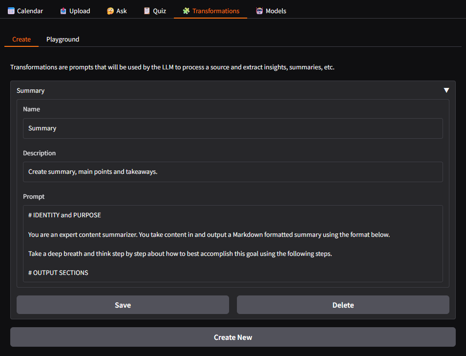

# 🧠 ReMind

ReMind, your ultimate study companion app designed to revolutionize the way you learn and retain information. Whether you're a student, a professional, or a lifelong learner, ReMind is here to reinvigorate your study sessions and help you reach your educational goals. Rediscover the joy of learning with our innovative features that are tailored to enhance your study experience. ReMind not only helps you retain information but also reinforces your knowledge through strategic quizzes, ensuring that what you learn today remains with you tomorrow.

## Features

- **Seamless Content Parsing**: Effortlessly convert PDF, DOCX, XLSX, HTML, YouTube, webpages, and more into your personalized notes.
- **Customizable Note Transformations**: Transform your notes into key points, summaries, or any format you desire. Design how AI should reshape your notes to fit your learning style.
- **Intelligent Topic Tagging**: Automatically tag your notes with relevant topics using AI, making organization and retrieval a breeze.
- **Interactive Q&A**: Engage with your notes by asking questions and receiving insightful answers, deepening your understanding.
- **Motivational Activity Chart**: Stay motivated with a GitHub-like activity chart that encourages daily learning and tracks your progress.
- **Knowledge Reinforcement Quizzes**: Reinforce your learning with quizzes that prompt you with questions 2, 7, and 30 days after uploading your notes, ensuring long-term retention.
- **Text-to-Speech Functionality**: Listen to your notes with our text-to-speech feature, perfect for auditory learners or on-the-go review.
- **Local and Global AI Support**: Focus on local AI with support for Ollama, while also integrating with other AI providers like OpenAI, LiteLLM, OpenRouter, Gemini, Anthropic, and more.

ReMind is here to reshape your study habits, helping you retain, reinforce, and rediscover the joy of learning.

## Setup

1. Set up MongoDB Altas with Atlas CLI (required for vector search):

```bash
atlas deployments setup atlas --type local --port 27017
```

2. (Optional) If you want to set up Firecrawl locally:

```bash
git clone https://github.com/mendableai/firecrawl
cd firecrawl
cp apps/api/.env.example .env
sed -i 's/USE_DB_AUTHENTICATION=true/USE_DB_AUTHENTICATION=false/' .env
docker compose build
docker compose up -d
cd ..
```

3. (Optional) Set up Ollama if you want to use local LLM models.

4. Copy `.env.example` to `.env` and edit `.env` file.

```bash
cp .env.example .env
vim .env
```

If you have set up firecrawl locally, set `FIRECRAWL_API_BASE=http://localhost:3002`. Otherwise, optionally provide your `FIRECRAWL_API_KEY`.

5. Start the WebUI with:

```bash
uv run webui.py
```

Open http://localhost:7860 in your browser.

## WebUI

### Add AI Models

Go to the "🤖 Models" tab. Configure your AI models there.

Local AI Recommendations:
- LLM: Provider Ollama, model name: [phi4](https://ollama.com/library/phi4)
- Embedding: Provider Ollama, model name: [bge-m3](https://ollama.com/library/bge-m3)
- Speech-to-text: Provider [Parakeet](https://huggingface.co/nvidia/parakeet-tdt-0.6b-v2), model name: nvidia/parakeet-tdt-0.6b-v2
- Text-to-speech: Provider [Chatterbox](https://huggingface.co/ResembleAI/chatterbox), model name: default male or female. You can add your own voice.

### AI Note Transformation

You can setup different prompts to summarize, expand, extract insights and much more in the "🧩 Transformations" tab. Example: `Translate this text to French`. For inspirations, check out https://github.com/danielmiessler/fabric/tree/main/patterns. You can try out your prompts in the Playground page.




### Upload your Notes

1. Upload your notes in any formats. Convert to Markdown text.

2. Transform the notes into anything your want. How the notes should be transformed is customized in the "🧩 Transformations" tab.

3. Edit and save your notes.


### Chat with your Notes

You can ask any questions in "🤔 Ask" tab. The Teacher chatbot will search through your notes and answer your questions with citations.

### Activity Chart


You can click on any date on the activity chart to check out all the notes on that day.

### Listen to your Notes


## Acknowledgements

- [Bokeh Activity Chart](https://discourse.bokeh.org/t/heatmap-calendar/12237)
- [Chatterbox](https://github.com/resemble-ai/chatterbox)
- [Docling](https://github.com/docling-project/docling)
- [Open Notebook](https://github.com/lfnovo/open-notebook)
- [Firecrawl](https://github.com/mendableai/firecrawl)
- [Nvidia Parakeet](https://huggingface.co/nvidia/parakeet-tdt-0.6b-v2)
